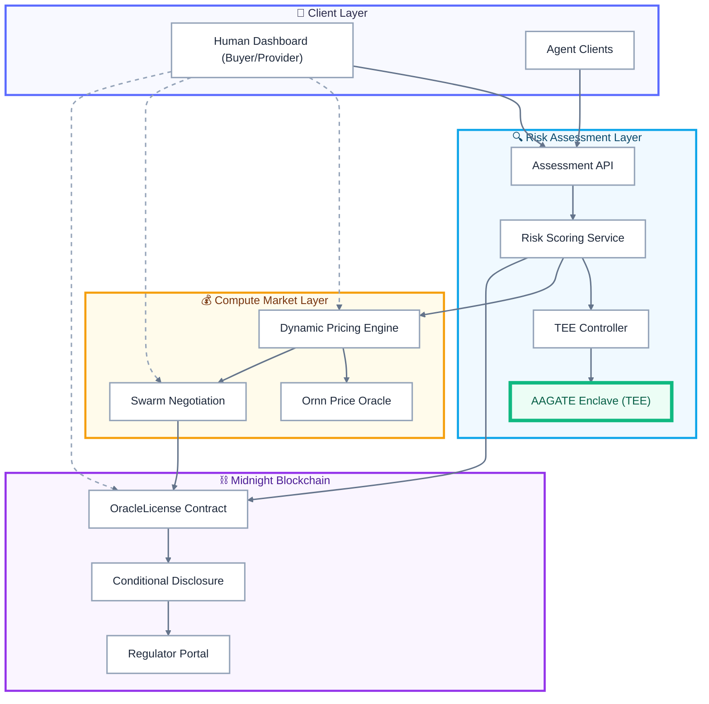

# ORACLE Protocol

**Risk-Adjusted Compute Markets for Frontier AI**  
*Turning AI safety posture into a live economic signal, enforced on Midnight.*

---

<div align="center">

[](#status--versioning)  
[](./LICENSE)  

**This repo contains:**

- A clear **architecture & protocol overview**
- A full **v1.1 software spec** for implementers
- A **developer-friendly API guide**
- A machine-readable **OpenAPI 3.1 spec** (`openapi.yaml`)

</div>

---

## Table of Contents

0. [Why ORACLE Exists](#0-why-oracle-exists)  
   - [Core Primitives (At a Glance)](#01-core-primitives-at-a-glance)  
1. [High-Level Architecture](#1-high-level-architecture)  
   - [Layers](#11-layers)  
   - [System Diagram](#12-system-diagram)  
2. [End-to-End Protocol Walkthrough](#2-end-to-end-protocol-walkthrough)  
3. [Workload Manifests & Risk Scoring](#3-workload-manifests--risk-scoring)  
   - [Compute Manifest Schema (Conceptual)](#31-compute-manifest-schema-conceptual)  
   - [Risk Scoring Semantics](#32-risk-scoring-semantics)  
4. [Market Mechanics & Pricing](#4-market-mechanics--pricing)  
   - [Base Rates via Ornn](#41-base-rates-via-ornn)  
   - [Risk-Adjusted Pricing](#42-risk-adjusted-pricing)  
   - [Swarm Negotiation](#43-swarm-negotiation)  
5. [Midnight Integration & OracleLicense](#5-midnight-integration--oraclelicense)  
   - [License Lifecycle](#51-license-lifecycle)  
   - [Conditional Disclosure Logic](#52-conditional-disclosure-logic)  
6. [Security & Threat Model](#6-security--threat-model)  
7. [Developer Integration Guide](#7-developer-integration-guide)  
8. [Status & Versioning](#8-status--versioning)  
9. [Glossary](#9-glossary)  

---

## 0. Why ORACLE Exists

Frontier AI compute today is sold like commodity electricity:

- Prices rarely reflect the **risk of the workload** being run.  
- Labs lack a neutral way to prove workloads are **low-risk** without leaking IP.  
- Regulators see frontier deployments **late**, if at all.  
- Safety and privacy are treated as **externalities**, not priced into the market.

ORACLE flips this by turning **safety posture into a live economic signal**:

- AI workloads are **assessed for risk inside TEEs** using the AAGATE enclave.  
- Risk scores drive **safety-contingent pricing**, anchored to a neutral compute index (Ornn).  
- Workloads receive **privacy-preserving compute licenses** on the Midnight chain, with **conditional disclosure** for high-risk cases.  
- Human operators and **autonomous agents** negotiate compute contracts with **on-chain escrow** and enforceable terms.

Instead of “flat price + compliance PDF”, ORACLE offers:

> **Risk-aware pricing + programmable enforcement**, backed by cryptographic attestation.

### 0.1 Core Primitives (At a Glance)

These primitives are referenced throughout the spec and may be implemented with multiple concrete backends.

- **AAGATE**  
  A TEE-resident assessment engine that inspects workload manifests and runtime parameters to compute a **risk score** and associated metadata. Runs inside secure enclaves managed by the TEE Controller.

- **Ornn**  
  A neutral **compute price index** (e.g., reference GPU-hour rate for specific hardware profiles). ORACLE uses Ornn as a **base rate** for all pricing decisions.

- **Midnight**  
  The blockchain where **OracleLicense** contracts, **escrow**, and **conditional disclosure** logic are deployed. Midnight acts as the source of truth for license state and regulatory disclosures.

---

## 1. High-Level Architecture

ORACLE is structured as four layers, each with a clear responsibility boundary:

1. **Client Layer (👤)** – How humans and agents request and monitor compute.  
2. **Risk Assessment Layer (🔍)** – How workloads are evaluated and attested inside TEEs.  
3. **Compute Market Layer (💰)** – How prices are set and deals are negotiated based on risk.  
4. **Midnight Layer (⛓️)** – How contracts, escrow, and disclosures are enforced on-chain.

### 1.1 Layers

#### 1. Client Layer (👤)

Interfaces for workload owners and providers:

- **Human Dashboard (Next.js)**  
  Web UI for buyers and providers to submit workloads, view risk scores, inspect offers, and sign deals.

- **Agent Clients**  
  Autonomous agents acting on behalf of labs or providers (e.g., “always buy H100 at risk ≤ 1.5 and price ≤ 1.1× Ornn”).

> The client layer does **not** compute risk or set prices.  
> It **expresses intent** and **consumes signals** from lower layers.

---

#### 2. Risk Assessment Layer (🔍)

Services responsible for **computational truth** about workloads:

- **Assessment API**  
  Public entry point for submitting workload manifests and (optionally) attestation evidence. Returns risk scores and assessment artifacts.

- **Risk Scoring Service**  
  Applies policy and models (including AAGATE outputs) to produce a canonical **risk score** and **risk classification** (e.g., LOW, MODERATE, HIGH, CRITICAL).

- **TEE Controller**  
  Orchestrates TEE lifecycle:
  - Provisions enclaves on supported hardware (e.g., AWS Nitro, Intel SGX, AMD SEV).  
  - Loads container images and configuration.  
  - Requests and validates hardware attestation reports.

- **AAGATE Enclave(s)**  
  Runs inside TEEs to inspect manifests, runtime parameters, and (optionally) code/config, producing a **signed risk assessment** that is bound into the TEE’s attestation.

> This layer is the **source of truth** for the risk signal that the Compute Market and Midnight layers consume.

---

#### 3. Compute Market Layer (💰)

Components that translate risk into **prices and deals**:

- **Dynamic Pricing Engine**  
  Combines risk scores, Ornn index values, provider-specific curves, and current capacity to quote **risk-adjusted rates** for workloads.

- **Ornn Price Oracle Adapter**  
  Fetches and normalizes external compute index values (e.g., base H100 hourly rate) and exposes them internally through a simple interface.

- **Swarm Negotiation Service**  
  Matches buyers and providers (human or agent) based on risk, price, and capacity. Produces a **deal intent** that is finalized on Midnight as an OracleLicense.

> This layer never modifies risk scores. It **prices and routes** based on them.

---

#### 4. Midnight Layer (⛓️)

On-chain enforcement of negotiated terms:

- **OracleLicense Contract**  
  Mints **compute licenses** that bind together:
  - Workload ID & manifest hash  
  - Risk score & classification  
  - Provider and buyer identities  
  - Price, duration, and capacity terms  

  Holds escrowed funds and exposes state transitions (e.g., CREATED → ACTIVE → SETTLED → DISPUTED).

- **Conditional Disclosure Module**  
  Encodes threshold logic such as:
  - “If attested risk ≥ 2.0, send verifiable disclosure to regulators X and Y.”  
  - “If runtime deviation exceeds configured envelope, emit on-chain event and freeze license.”

- **Regulator Portal**  
  Read-only interface (and notification sink) for authorized regulators to receive and verify disclosures. Provides:
  - Verification of TEE attestations.  
  - Access to minimal disclosure payloads (workload ID, risk score, timestamp, proof).

Once a license is minted, the Midnight layer becomes the **authoritative record** of the agreement and its disclosure obligations.

---

### 1.2 System Diagram

The diagram below shows how requests flow from clients into TEEs, through risk scoring and pricing, and finally onto Midnight for enforcement.



---

## 2. End-to-End Protocol Walkthrough

This section describes a typical ORACLE flow from the perspective of a **buyer** submitting a high-risk workload.

1. **Buyer prepares manifest**  
   - The lab defines a `ComputeManifest` describing model, hardware requirements, runtime environment, data access, and initial **risk declaration**.  
   - The manifest includes a `disclosurePolicy` section specifying thresholds and regulator recipients.

2. **Client submits workload**  
   - The buyer (human or agent) calls the **Assessment API**:
     - `POST /v1/assessment/manifest` with `ComputeManifest` JSON.  
   - The API returns an `assessment_id` and initial validation status.

3. **TEE provisioning & AAGATE assessment**  
   - The **TEE Controller**:
     - Selects a suitable TEE backend (e.g., AWS Nitro).  
     - Provisions an enclave and loads the AAGATE runtime plus relevant workload metadata.  
   - **AAGATE**:
     - Validates manifest structure and policies.  
     - Optionally inspects container image hashes/config against known patterns.  
     - Computes a **provisional risk score**, `risk_level`, and explanation.

4. **Hardware attestation generation**  
   - The TEE generates an **attestation report** that includes:
     - Measurement of loaded code and configuration.  
     - AAGATE output (`risk_score`, `risk_level`, workload ID).  
     - Relevant policy flags and disclosure parameters.  
   - The attestation is signed by the TEE hardware root key.

5. **Risk Scoring consolidation**  
   - The **Risk Scoring Service**:
     - Verifies the TEE attestation against vendor public keys.  
     - Applies additional policy rules (org-level caps, regulatory regimes).  
     - Produces a **canonical risk record**:
       ```json
       {
         "workload_id": "grok6-ablation-study-001",
         "risk_score": 2.3,
         "risk_level": "CRITICAL",
         "source": "AAGATE@nitro-v1.2",
         "attestation_hash": "0x...",
         "timestamp": "2025-11-18T09:14:41Z"
       }
       ```

6. **Pricing & negotiation**  
   - The **Dynamic Pricing Engine** queries:
     - Ornn for base H100 rate.  
     - Provider curves and current capacity.  
   - It computes a **risk-adjusted price quote**, e.g.:
     - `$5.79 / H100-hour for risk_score = 2.3`.  
   - The **Swarm Negotiation Service**:
     - Broadcasts the workload to eligible providers.  
     - Collects bids and counter-offers.  
     - Produces a **deal intent** (selected provider, final price, SLA).

7. **License creation on Midnight**  
   - The buyer and provider both sign off (via dashboard or agent).  
   - A transaction is sent to the **OracleLicense contract** containing:
     - Manifest hash.  
     - Canonical risk record.  
     - Price, duration, capacity.  
     - Escrow amount (buyer funds).  
   - The contract:
     - Mints a new license ID.  
     - Locks escrow.  
     - Emits a `LicenseCreated` event.

8. **Compute execution**  
   - The provider uses the license ID and manifest to run the workload in a TEE, under the agreed configuration.  
   - Optional: runtime telemetry is streamed back to AAGATE or another verifier.

9. **Conditional disclosure (if triggered)**  
   - If the risk score or runtime signals cross configured thresholds:
     - The **Conditional Disclosure Module** prepares a minimal disclosure payload.  
     - A **verifiable credential (VC)** is generated and delivered to configured regulator endpoints (or made retrievable via the Regulator Portal).  
     - On-chain events log that a disclosure occurred, without leaking sensitive details.

10. **Settlement & close-out**  
    - After successful completion (or expiry), the provider or buyer calls `settleLicense`.  
    - The OracleLicense contract:
      - Releases funds to the provider (minus fees).  
      - Updates license state to `SETTLED`.  
      - Emits a `LicenseSettled` event.

---

## 3. Workload Manifests & Risk Scoring

### 3.1 Compute Manifest Schema (Conceptual)

A `ComputeManifest` is a declarative description of the workload. Concrete schema is defined in `openapi.yaml`; the outline below shows the main concepts.

```json
{
  "workloadId": "grok6-ablation-study-001",
  "owner": {
    "orgId": "xai",
    "did": "did:example:xai:1234"
  },
  "model": {
    "name": "Grok-6",
    "version": "6.2.0",
    "type": "frontier"
  },
  "computeRequirements": {
    "gpuType": "H100",
    "gpuCount": 100,
    "durationHours": 48,
    "memoryGB": 1024,
    "diskGB": 4096
  },
  "dataAccess": {
    "sources": [
      {
        "type": "s3",
        "uri": "s3://xai-internal/grok6-dataset-v2.tar.gz",
        "encryption": "KMS"
      }
    ],
    "dataSensitivity": "HIGH"
  },
  "runtimeEnvironment": {
    "dockerImage": "xai/grok6-ablation-runtime:latest",
    "entrypoint": "/app/run_ablations.sh"
  },
  "declaredRisk": {
    "selfDeclaredScore": 2.0,
    "intendedUse": "AI_SAFETY_ABLATION",
    "notes": "Ablation of alignment heads; potential emergent behavior if misconfigured."
  },
  "disclosurePolicy": {
    "thresholdScore": 2.0,
    "level": "CRITICAL",
    "recipients": [
      "nist-aisafety@gov",
      "eu-aioffice@europa.eu"
    ],
    "mode": "VC_EMAIL_AND_PORTAL"
  }
}
```

Key goals:

- Keep it **machine-readable** and **policy-friendly**.  
- Make all disclosed risk parameters **auditable and attestable**.  
- Allow separation between **self-declared** and **assessed** risk.

### 3.2 Risk Scoring Semantics

The ORACLE v1.1 protocol assumes:

- A **continuous risk_score** (e.g., `0.0` – `3.0+`)  
- A **categorical risk_level** for humans and policies:

| Level      | Example Range | Description                                                  |
|-----------:|--------------:|--------------------------------------------------------------|
| LOW        | 0.0 – < 0.7   | Routine workloads with minimal externalities                 |
| MODERATE   | 0.7 – < 1.5   | Non-trivial risk; requires standard safeguards               |
| HIGH       | 1.5 – < 2.0   | Elevated risk; strong governance and containment required    |
| CRITICAL   | ≥ 2.0         | Frontier safety experiments, dual-use concerns, etc.         |

**Rules of thumb in v1.1:**

- `risk_score` is always derived from **TEE-backed AAGATE output**, optionally combined with policy overrides.  
- `risk_level` is computed deterministically from `risk_score`.  
- Both values are:
  - Embedded into TEE attestation.  
  - Stored in license state on Midnight.  
  - Exposed (partially) via disclosures when thresholds are breached.

---

## 4. Market Mechanics & Pricing

### 4.1 Base Rates via Ornn

The **Ornn adapter** provides a normalized view of base compute prices, like:

```json
{
  "timestamp": "2025-11-18T09:00:00Z",
  "gpuProfiles": [
    { "type": "H100_80GB", "baseRate": 4.00 },
    { "type": "A100_80GB", "baseRate": 2.75 }
  ],
  "currency": "USD",
  "confidence": 0.97
}
```

Requirements:

- Time-bounded, signed data (e.g., via off-chain signatures or on-chain oracles).  
- Hardware-profile specific base rates.  
- Confidence scores and fallback behavior if stale.

### 4.2 Risk-Adjusted Pricing

The **Dynamic Pricing Engine** combines:

- `baseRate` from Ornn.  
- `risk_score` and `risk_level` from Risk Scoring.  
- Provider-specific curves (e.g., risk appetite, capacity constraints).  

Example (simplified):

```text
effective_rate = baseRate
               * (1 + alpha * risk_score)
               * capacityMultiplier
               * providerRiskPreference
```

Where:

- `alpha` is a protocol-level parameter (e.g., 0.3).  
- `capacityMultiplier` increases price when utilization is high.  
- `providerRiskPreference < 1` for risk-tolerant providers, > 1 for conservative ones.

### 4.3 Swarm Negotiation

The negotiation model is:

1. **Broadcast candidate job** to eligible providers:
   - Hardware match.  
   - TEE capability match.  
   - Regime / jurisdiction constraints.  

2. **Collect provider responses**:
   - Accept protocol quote.  
   - Counter with limited overrides (e.g., add latency premium).  
   - Decline.

3. **Aggregate offers** and select a **Pareto-optimal subset** based on buyer preferences:
   - Cheapest within SLA.  
   - Or geographically distributed.  
   - Or highest reputation.

4. **Produce `deal_intent`**:
   - A structured record that will be turned into an OracleLicense.  
   - Contains all fields necessary for on-chain creation.

---

## 5. Midnight Integration & OracleLicense

### 5.1 License Lifecycle

The **OracleLicense** contract exposes a state machine:

```text
PENDING -> ACTIVE -> { SETTLED | DISPUTED | EXPIRED }
```

Key transitions:

- `createLicense` (off-chain negotiation → on-chain license):
  - Inputs: manifest hash, risk record hash, price, duration, participants, escrow.  
  - Effects: license minted, escrow locked.

- `activateLicense` (provider acknowledges start of compute):
  - Optionally tied to TEE attestation of workload start.

- `settleLicense`:
  - Called after successful completion, releases funds to provider.  
  - May be conditioned on off-chain verification or TEE completion attestation.

- `raiseDispute`:
  - Called if buyer alleges misbehavior (SLA violation, incorrect environment).  
  - Freezes funds and kicks off dispute resolution process (out of scope for v1.1).

### 5.2 Conditional Disclosure Logic

The **Conditional Disclosure Module** is configured per-license with rules like:

```json
{
  "thresholdScore": 2.0,
  "regulatorRecipients": [
    "did:gov:nist:aisafety",
    "did:gov:eu:aioffice"
  ],
  "disclosureLevel": "RISK_SUMMARY",
  "deliveryMode": ["PORTAL", "SIGNED_EMAIL"]
}
```

When a trigger condition is met (e.g., `risk_score >= thresholdScore` or runtime anomaly):

1. A **disclosure payload** is assembled off-chain:
   - `workload_id`  
   - `risk_score` and `risk_level`  
   - `timestamp`  
   - Attestation proof hash  
   - License ID

2. A **Verifiable Credential (VC)** is created and anchored:
   - Hash of VC can be stored on Midnight.  
   - VC itself delivered via regulator’s preferred channel(s).

3. The module emits an on-chain `DisclosureEmitted` event with:
   - License ID.  
   - Minimal metadata (no sensitive details).  
   - VC hash / reference.

---

## 6. Security & Threat Model

**Goals:**

- Prevent undetected tampering with risk assessments.  
- Prevent silent high-risk workloads from bypassing disclosure.  
- Minimize data leakage while still supporting regulatory oversight.

**Non-goals (v1.1):**

- Full runtime behavioral verification of arbitrary models.  
- On-chain storage of sensitive datasets or model weights.

Threat categories:

1. **Malicious buyer**  
   - Mis-declares workload to appear low-risk.  
   - Attempts to bypass TEEs or alter manifests at runtime.  
   - *Mitigation:* AAGATE inspections, manifest hashing, attestation verification, reputation.

2. **Malicious provider**  
   - Runs workload outside agreed TEE environment.  
   - Misreports completion or runtime configuration.  
   - *Mitigation:* TEE attestation tied to license activation & settlement; random audits.

3. **Compromised TEE / vendor**  
   - Hardware-level bug or key leak.  
   - *Mitigation:* Pluggable backend list, revocation lists, multi-TEE redundancy (future).

4. **Regulator misuse**  
   - Over-collection or mishandling of received disclosures.  
   - *Mitigation:* Data minimization; VC design limited to essential metadata.

---

## 7. Developer Integration Guide

### 7.1 Typical Buyer Integration

1. **Generate manifest** based on internal workload description.  
2. **Call Assessment API**:
   - `POST /v1/assessment/manifest`  
   - Poll `GET /v1/assessment/{id}` for status and risk result.

3. **Request quote**:
   - `POST /v1/market/quote` with workload ID and desired SLA.  
   - Receive risk-adjusted price curve or discrete offers.

4. **Confirm deal**:
   - `POST /v1/market/accept` with selected offer.  
   - Backend will create license on Midnight; you receive `license_id`.

5. **Monitor & settle**:
   - `GET /v1/licenses/{license_id}` for state.  
   - Call `settle` endpoint or trigger via dashboard after completion.

### 7.2 Typical Provider Integration

1. **Register capacity** (off-chain in v1.1):
   - Declare hardware, TEEs, risk preferences, and jurisdictions.

2. **Watch for offers**:
   - Webhook or polling on `/v1/provider/offers`.  

3. **Bid / accept**:
   - Respond with price adjustments or acceptance.  

4. **Execute with license**:
   - Use `license_id` and manifest to start TEE job.  
   - Optionally push runtime telemetry to ORACLE for enhanced reputation.

---

## 8. Status & Versioning

- **Current protocol version:** `1.1.0`  
- **Stability:** Experimental; suited for pilot deployments and testnets.  
- **Breaking changes policy:**
  - Minor versions (`1.x`) may add fields but avoid breaking existing schema where practical.  
  - Major versions (`2.0+`) may introduce new risk models or contract semantics.

See [`CHANGELOG.md`](./CHANGELOG.md) for a detailed history.

---

## 9. Glossary

- **AAGATE** – TEE-resident risk assessment enclave.  
- **Attestation** – Cryptographically signed statement by TEE hardware about loaded code and configuration.  
- **Compute Manifest** – Declarative specification of workload, hardware needs, data access, and risk declaration.  
- **Conditional Disclosure** – Automatic notification to regulators when risk thresholds or anomalies are triggered.  
- **Midnight** – Blockchain where OracleLicense and disclosure logic live.  
- **OracleLicense** – On-chain contract binding workload, risk, price, and escrow.  
- **Ornn** – Neutral compute price index used as base rate.  
- **Risk Score / Level** – Numeric and categorical measure of workload risk produced by ORACLE.  
- **TEE (Trusted Execution Environment)** – Hardware-isolated execution environment providing confidentiality and attestation.

---

For concrete request/response shapes, authentication, and error codes, see the **OpenAPI 3.1 spec** in [`openapi.yaml`].
