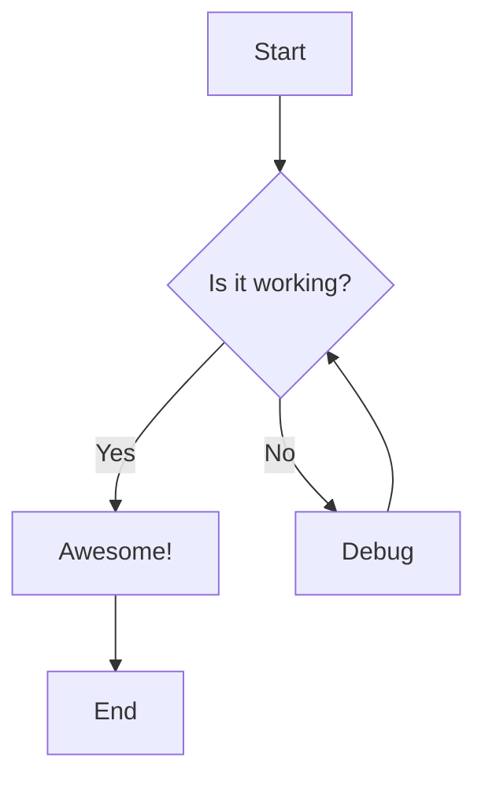
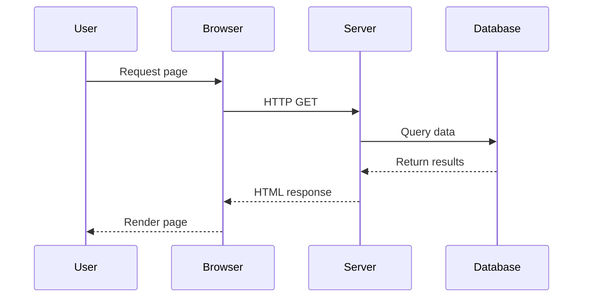
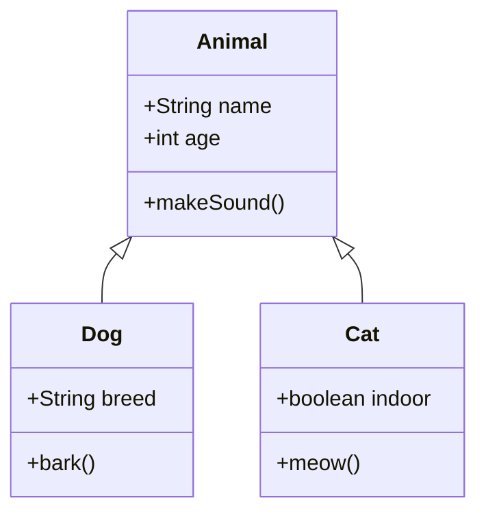
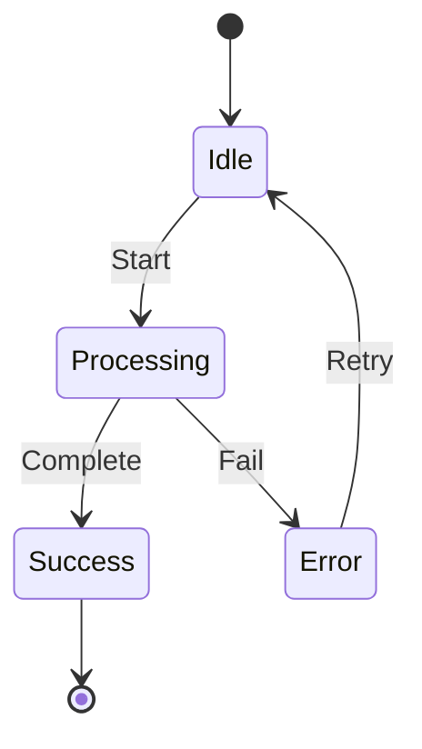

# Mermaid Diagram Test

This is a test page demonstrating Mermaid diagram rendering.

## Flowchart Example

```mermaid
flowchart TD
    A[Start] --> B{Is it working?}
    B -->|Yes| C[Awesome!]
    B -->|No| D[Debug]
    C --> E[End]
    D --> B
```

## Sequence Diagram

```mermaid
sequenceDiagram
    participant User
    participant Browser
    participant Server
    participant Database
    
    User->>Browser: Request page
    Browser->>Server: HTTP GET
    Server->>Database: Query data
    Database-->>Server: Return results
    Server-->>Browser: HTML response
    Browser-->>User: Render page
```

## Class Diagram

```mermaid
classDiagram
    class Animal {
        +String name
        +int age
        +makeSound()
    }
    class Dog {
        +String breed
        +bark()
    }
    class Cat {
        +boolean indoor
        +meow()
    }
    
    Animal <|-- Dog
    Animal <|-- Cat
```

## State Diagram

```mermaid
stateDiagram-v2
    [*] --> Idle
    Idle --> Processing: Start
    Processing --> Success: Complete
    Processing --> Error: Fail
    Success --> [*]
    Error --> Idle: Retry
```